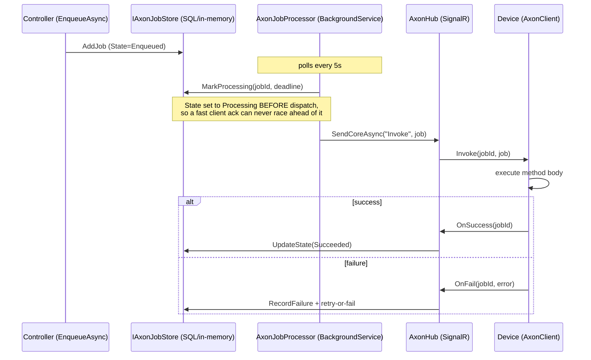
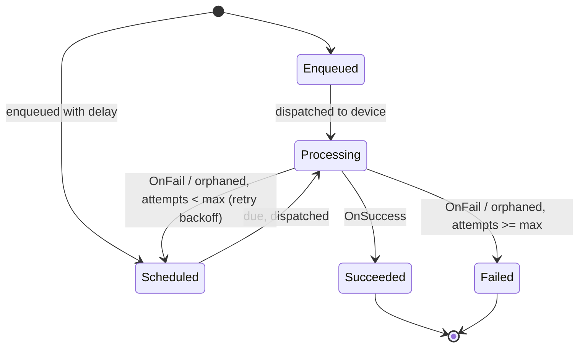
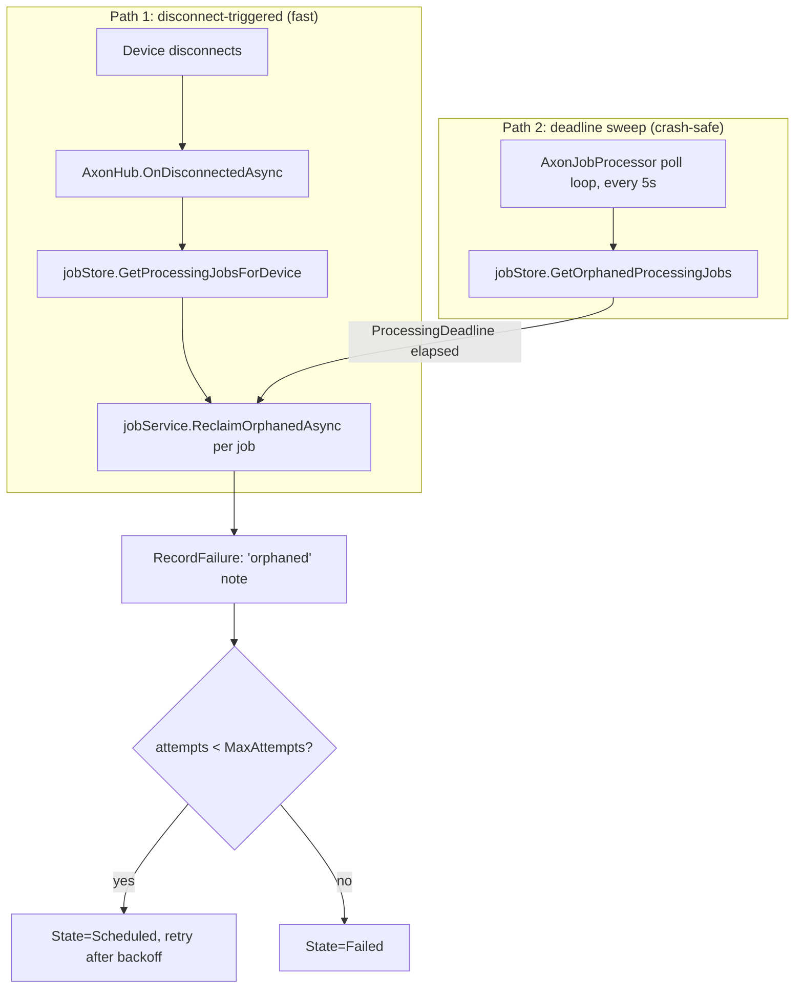
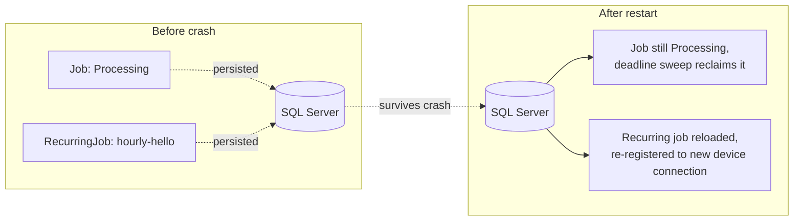
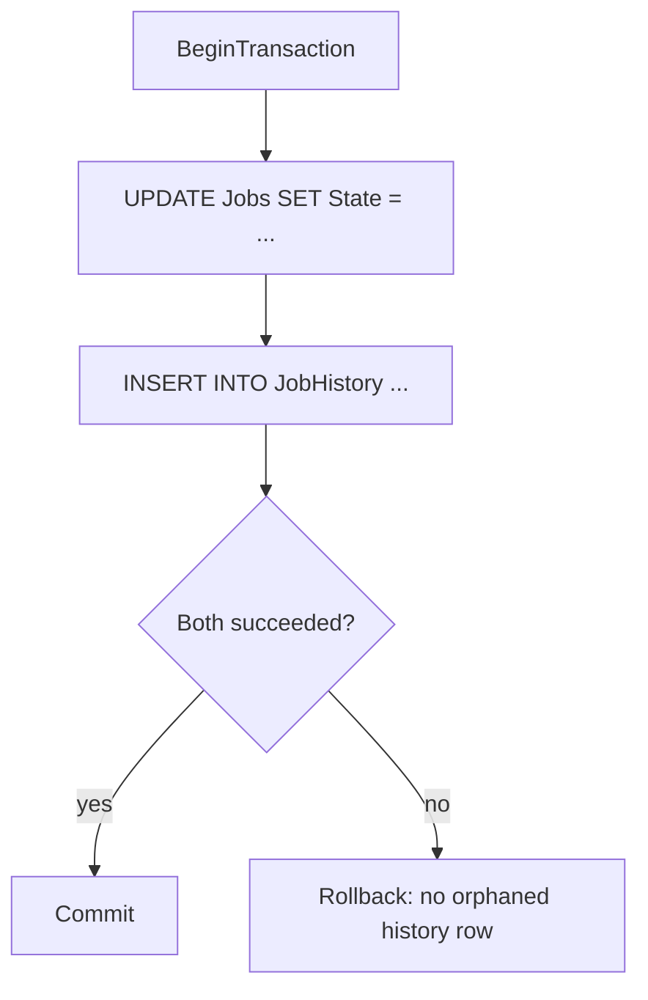

# Axon Architecture

## Job dispatch and completion

## Job state machine

## Orphan reclaim (crash / disconnect recovery)

Two independent paths reclaim a job stuck in `Processing`, so recovery doesn't depend on a clean disconnect:

Path 2 is what makes the reclaim survive a server crash: `ProcessingDeadline` is persisted in SQL alongside the job, so a freshly restarted server rediscovers stuck jobs from durable state alone — it doesn't need to have witnessed the original disconnect.

## Server restart recovery

## SQL store transactional writes

Every paired state-change write (job state + history row) runs inside a single SQL transaction, so a failure between the two statements can't leave the history table out of sync with the job's actual state:

