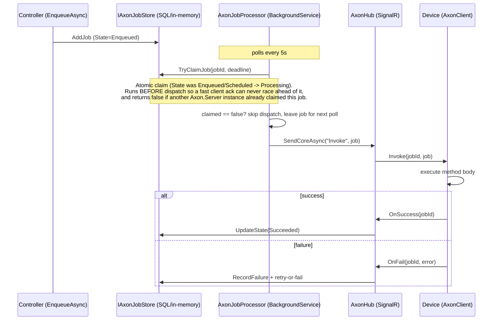
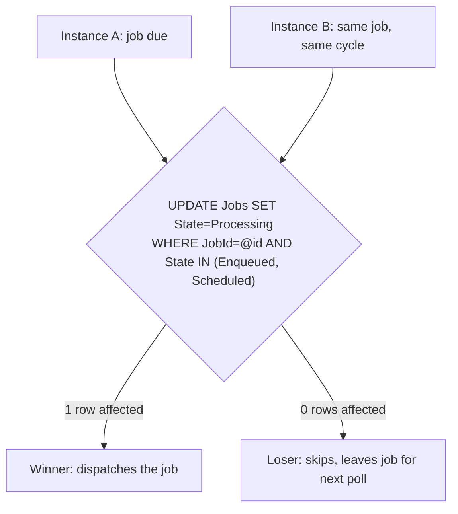
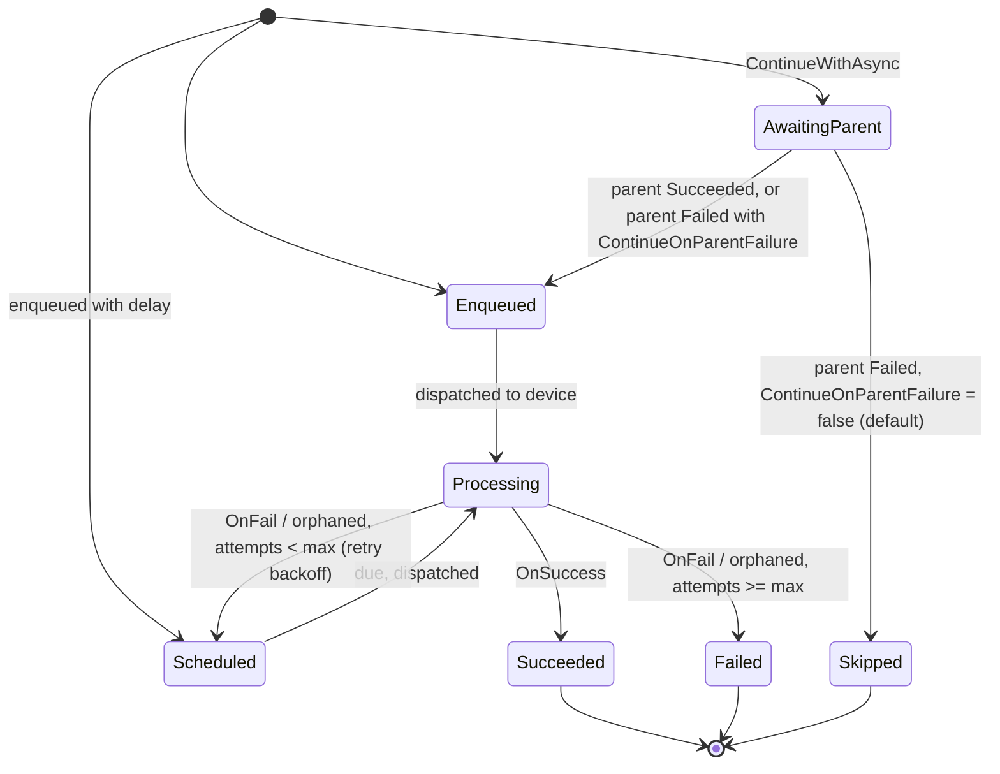
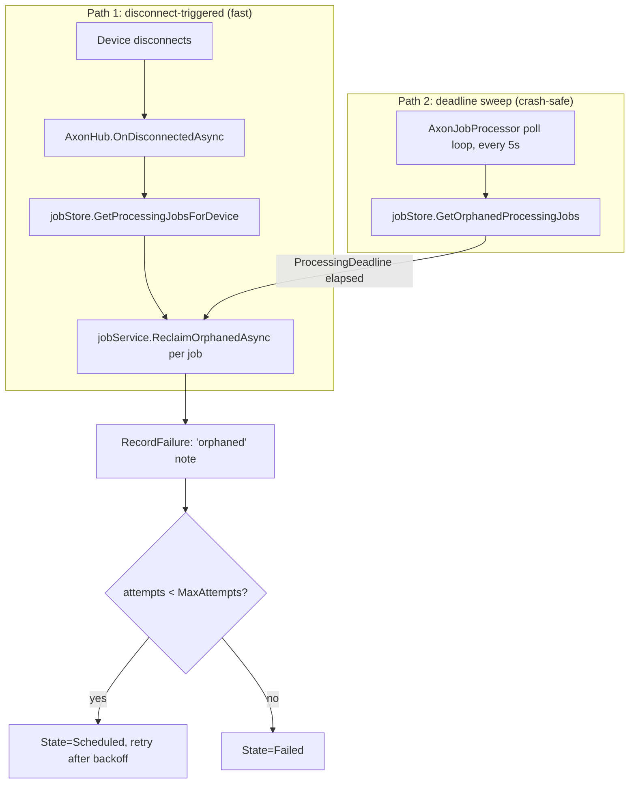
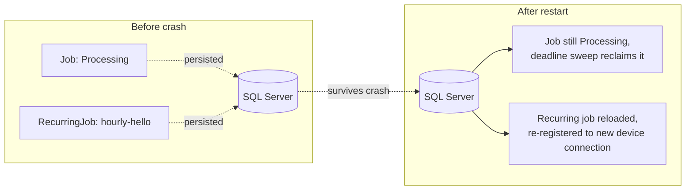
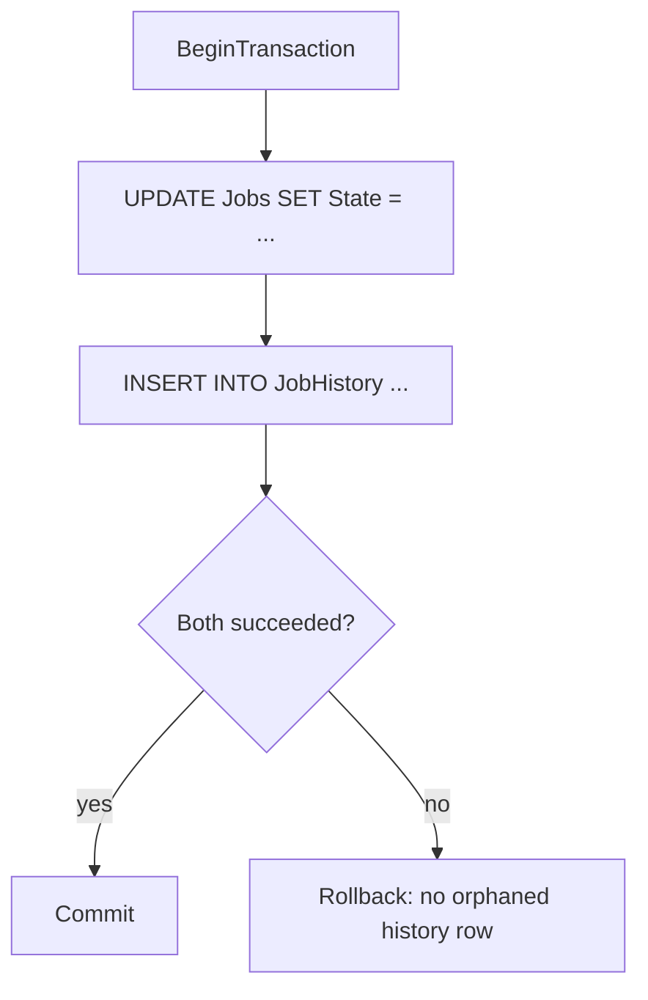

# Axon Architecture

## Job dispatch and completion



## Multi-instance dispatch safety

Every `AxonJobProcessor` instance (one per `Axon.Server` process) independently polls for due jobs. With `Axon.Store.SqlServer`, `Axon.Store.Postgres`, `Axon.Store.MySql`, or `Axon.Store.MongoDb` shared across multiple instances, more than one instance can see the same job as due in the same poll cycle. `TryClaimJob` makes only one of them win:



The `WHERE State IN (...)` guard is enforced by SQL Server's row lock for the duration of the `UPDATE`, so exactly one instance's statement can match and affect a row even under truly concurrent execution - the other gets `0` rows affected and must not dispatch. The in-memory store enforces the same guarantee under its own lock, so behavior is consistent regardless of backend (though the in-memory store is inherently single-instance, since nothing shares its state across processes).

The `ConcurrencyKey`/`MaxConcurrent` limit (see the README's concurrency-limit section) adds a second race-safety requirement on top of the plain claim above: the count of currently-`Processing` jobs sharing a `ConcurrencyKey` must be checked atomically against other instances claiming jobs with the same key, not just against the target row itself. Each backend enforces this with its own locking primitive:

- **SQL Server** (`AxonSqlServerStore.TryClaimJob`): `WITH (UPDLOCK, HOLDLOCK)` on the count subquery holds the scanned key-range's locks for the rest of the transaction, so a second concurrent claim against the same key blocks (or deadlocks and retries, on SQL error 1205) rather than reading a stale count.
- **PostgreSQL** (`AxonPostgresStore.TryClaimJob`): a `pg_advisory_xact_lock` keyed on the job's `ConcurrencyKey` (hashed via `hashtext`) serializes every concurrent claim against that key for the duration of the transaction. A plain `SELECT ... FOR UPDATE` on the count query doesn't work here: when several claims are racing to be the *first* job with a given key to become `Processing`, there's no existing `Processing` row yet for any of them to row-lock, so `FOR UPDATE` alone wouldn't block them against each other - the advisory lock is keyed on the `ConcurrencyKey` value itself, not on any row, so it still serializes them.
- **MySQL** (`AxonMySqlStore.TryClaimJob`): a plain `SELECT ... FOR UPDATE` on the count subquery, relying on InnoDB's default `REPEATABLE READ` isolation - unlike Postgres, InnoDB's locking reads take a next-key (row-plus-gap) lock covering the whole range matched by the `WHERE` clause, including the gap where a not-yet-existing `Processing` row for the key would be inserted, so it does block a concurrent claim racing to become the first `Processing` job for that key (verified directly by the 10-way concurrent `MaxConcurrent` test in `AxonMySqlStoreTests`). Retries on deadlock (InnoDB error 1213), same as SQL Server's 1205 retry.
- **MongoDB** (`AxonMongoStore.TryClaimJob`): a `ConcurrencyLocks` collection with one document per `ConcurrencyKey`, written to (a `$inc` via `FindOneAndUpdate`) by every claim against that key inside the same session-scoped transaction as the rest of the claim. This is necessary rather than incidental: MongoDB's write-conflict detection at commit time is purely per-document, so two concurrent claims that only *read* the same key's `Processing` count and then each write to their own distinct job document never collide from MongoDB's point of view and both commit cleanly - discovered directly when an earlier version of this store (with no `ConcurrencyLocks` collection) let all 10 claims in the concurrent `MaxConcurrent` test succeed instead of capping at 3. Forcing every claim against a key to write to the same lock document makes the conflict real: the loser's commit fails with a transient-transaction error and `TryClaimJob` retries it, the same "loser retries" shape as the other backends' deadlock handling. This also means `Axon.Store.MongoDb` requires a replica set (even a single-node one) - a standalone MongoDB server rejects `StartTransaction` outright ("Standalone servers do not support transactions") - see the README.
- **SQLite** (`AxonSQLiteStore.TryClaimJob`): no per-key locking at all - `BEGIN IMMEDIATE` takes SQLite's single process-wide write lock for the whole transaction, so at most one write transaction against the database file is ever in flight, full stop. This gives the same claim/count-check correctness as the other backends but by a coarser mechanism, and it's *why* `Axon.Store.SQLite` doesn't support the multi-instance scenario this section is about: the lock is process-wide, not per-key, so it wouldn't help two separate `Axon.Server` processes coordinate anyway (each process's SQLite connection only locks its own view of the file, and concurrent writers across processes/machines against the same SQLite file is not a supported usage pattern for the library). Treat `Axon.Store.SQLite` as covering the single-instance case (same as the in-memory store, but durable across restarts), not as a fourth entry in the multi-instance list above.

## Job priority

Every job carries a `Priority` (`JobPriority`: `Low`, `Medium` - the default, `High`, `Critical`), and every backend's `GetJobs` - the query `AxonJobProcessor.DispatchDueJobsAsync` uses to pick candidates, and the same one the dashboard's `/axon/jobs` listing uses - orders by an **effective dispatch score** instead of raw `ScheduledFor`.

### The intuition: boost is free virtual age

Think of "boost" as fake extra waiting time handed to a job based on its priority - it makes the job *look* older than it actually is when the scheduler decides what to run next. Jobs dispatch in order of who *looks* oldest (lowest score), not who's *actually* oldest.

- `Low`: boost = 0 - no free head start; the job's score is just its real enqueue time.
- `Medium`: boost = 5 min - looks 5 minutes older than it really is.
- `High`: boost = 15 min - looks 15 minutes older.
- `Critical`: boost = 60 min - looks 60 minutes older.

Example: the clock reads 12:00:00. Job A (`Low`) and Job B (`High`) are both enqueued at that exact instant.
- Job A's score: `12:00:00 - 0 = 12:00:00`
- Job B's score: `12:00:00 - 15min = 11:45:00`

Job B's score is earlier, so it dispatches first - its `High` priority faked 15 minutes of extra age onto it, even though both jobs are equally new. But if Job A had actually been sitting in the queue since 11:30:00 (30 real minutes) by the time Job B shows up at 12:00:00:
- Job A's score: `11:30:00 - 0 = 11:30:00`
- Job B's score: `12:00:00 - 15min = 11:45:00`

Now Job A's score is earlier, so Job A dispatches first - its 30 minutes of *real* waiting beat Job B's 15-minute *fake* boost. This is the whole mechanism: boost is a flat, capped amount of pretend age, enough to let urgent work cut in front of stuff that just arrived, but never enough to cut in front of something that's been genuinely waiting longer than the boost amount.

**This only matters when jobs are actually competing for a dispatch slot.** If a `Low` job is the only thing in the queue, it dispatches on the very next poll cycle regardless of its boost - priority never delays a job on its own, it only affects the job's position relative to others when there's contention. A `Low` job also isn't at risk of being starved forever by a flood of `High` jobs: each `High` job's score only depends on its *own* enqueue time, not on how many other `High` jobs exist, so a `Low` job that's been waiting longer than 15 minutes can no longer be jumped by *any* `High` job, no matter how many keep arriving - only jobs younger than that 15-minute window can still cut ahead of it.

### The formula

```
score = COALESCE(ScheduledFor, EnqueuedAt) - Boost[Priority]
```

(ascending; a lower score dispatches sooner.) `Boost` is a fixed per-priority tick offset, defined once in `Axon.Core.Enums.JobPriorityBoost` and duplicated as literal values in every backend's query text (SQL/BSON can't reference a .NET dictionary directly, so these must be kept in sync by hand if the boost values ever change):

| Priority | Boost | Max headstart over a `Low` job |
|---|---|---|
| `Low` | 0 | - |
| `Medium` | 5 min | 5 min |
| `High` | 15 min | 15 min |
| `Critical` | 60 min | 60 min |

The "max headstart" column is the boost value itself, since `Low` is the zero baseline. For two arbitrary priorities, the max headstart one can steal over the other is the *difference* between their boosts - e.g. `Critical` over `Medium` is `60 - 5 = 55 min`, and `Critical` over `High` is `60 - 15 = 45 min`.

Worked example: a `High` job enqueued 1 minute ago has `score = -1min - 15min = -16min` (relative to now); a `Low` job enqueued 1 minute ago has `score = -1min - 0 = -1min`, so the `High` job wins (lower score). But a `Low` job enqueued 20 minutes ago has `score = -20min - 0 = -20min`, which beats the 1-minute-old `High` job's `-16min` - the older `Low` job still dispatches first. (At exactly a 15-minute age gap the two scores tie; ties break on whatever secondary order the backend/driver happens to apply, so don't rely on exact-boundary behavior.)

**Behavior change from before this feature existed:** every backend's `ORDER BY` used to be `ScheduledFor` alone, and since an immediate ("run now") job has `ScheduledFor = NULL`, every backend's ascending sort put `NULL`s first - so an immediate job always dispatched before *any* scheduled-for-later job, no matter how old that scheduled job was. A boost can't be subtracted from `NULL`, so the score now uses `COALESCE(ScheduledFor, EnqueuedAt)` uniformly: immediate jobs compete with scheduled jobs on the same timeline (adjusted by priority) instead of automatically jumping the whole queue. This was an incidental side effect of the old sort, never a documented guarantee, and the new behavior is generally more sensible - but it is a real, observable change to existing deployments' dispatch order.

`TryClaimJob`'s atomicity is completely unaffected by any of this - dispatch order only decides *which* job's ID gets tried next in `AxonJobProcessor`'s poll loop, and `TryClaimJob` still only ever succeeds or fails based on the target job's current `State`, exactly as described above. There is no new race condition here, only a different candidate-selection order.

**MongoDB** (`AxonMongoStore.GetJobs`) is the one backend that can't express the score via a simple `ORDER BY`: `Priority` and `EffectiveScore` are computed per-document in an aggregation pipeline (`$addFields` with a `$switch` on `Priority`, mirroring the `$lookup`/`$addFields` pattern `DeleteCompletedJobsOlderThan` already uses), then `$sort`/`$skip`/`$limit`/`$unset` on that computed field - the C# driver's fluent `SortBy` can't reference a computed expression against a raw `BsonDocument`.

## Job queues

Every job carries a `QueueName` (default `"default"`), and every `Axon.Server` instance declares which queues it serves via `.AddQueues(...)` chained off `AddAxonServer()` (`Axon.Server/DependencyInjection.cs`'s `AddQueues` extension on `AxonServerBuilder`, following the same chaining shape as `Axon.Server.Redis`'s `AddRedisBackplane`). `.AddQueues(...)` always adds `"default"` to whatever's passed - it's never an exclusive allowlist, so an instance that opts into a custom queue doesn't stop serving ordinary unqueued jobs. An instance that never calls `.AddQueues(...)` serves only `"default"`, unchanged from before this feature existed.

Unlike `Priority` (a per-backend `ORDER BY`/aggregation change) and `ConcurrencyKey` (a per-backend locking primitive - see "Multi-instance dispatch safety" above), queue filtering is a **pure in-process routing decision**, not a store-level concern at all: `AxonJobProcessor.DispatchDueJobsAsync`'s poll-cycle loop gained one guard clause, checked before the existing device-connectivity check:

```csharp
if (!features.ServedQueues.Contains(job.QueueName))
{
    continue; // this instance doesn't serve this queue - leave for another instance/poll
}
```

`features` is the same `AxonServerFeatures` singleton that already holds `ApiEnabled`/`DashboardEnabled`, now also holding `ServedQueues`. No store's `GetJobs` query changed for this - it still fetches every due job system-wide, exactly as it always has for the device-connectivity check; queue filtering is just a second guard alongside that one, evaluated entirely in memory.

A job on a queue no live instance serves behaves exactly like a job whose target device is offline: it stays `Enqueued`/`Scheduled` and is retried every poll cycle (5s) until some instance's configuration serves it - it never fails, times out, or moves to any error state on its own. This is visible via the dashboard's Jobs table (each job's `Queue` column) and the Servers tab (each instance's `Queues` column, sourced from `ServerInstance.ServedQueues` - a comma-joined string, heartbeated fleet-wide every 15s alongside `MachineName`/`LastSeenAt`, same mechanism and same per-backend `ServerInstances` schema/upsert pattern used for every other instance field).

**Known gap, not introduced by this feature:** `RecurringJob(JobInfo)` (`Axon.Server/Services/RecurringJob.cs`) only copies `Arguments`/`MethodName`/`Assembly`/`DeclaringType` from `JobInfo` when a recurring job is created - it already silently drops `Priority`/`ConcurrencyKey`/`MaxConcurrent` today, and `QueueName` has the exact same gap. A job triggered from a recurring schedule always runs on `"default"` regardless of what queue the recurring job's `JobInfo` specified, until this pre-existing constructor gap is fixed separately.

## Job state machine



A continuation job (created via `ContinueWithAsync`) starts in `AwaitingParent` instead of `Enqueued`/`Scheduled`, so `AxonJobProcessor`'s poll loop never picks it up for dispatch until it's promoted. The parent's `MarkSucceededAsync`/terminal `MarkFailedAsync` path resolves every job waiting on it (`IAxonJobStore.GetContinuationsWaitingOn`) the moment the parent reaches Succeeded or Failed - including immediately, if the parent had already finished by the time the continuation was created.

## Orphan reclaim (crash / disconnect recovery)

Two independent paths reclaim a job stuck in `Processing`, so recovery doesn't depend on a clean disconnect:



Path 2 is what makes the reclaim survive a server crash: `ProcessingDeadline` is persisted in SQL alongside the job, so a freshly restarted server rediscovers stuck jobs from durable state alone — it doesn't need to have witnessed the original disconnect.

## Server restart recovery



## Graceful shutdown

Axon.Server never executes job bodies itself - those run on `Axon.Client`, on a different process/machine - so there's no in-flight job *execution* for the server to drain on shutdown. What can happen mid-shutdown is `AxonJobProcessor` being cancelled between claiming a job (`TryClaimJob` succeeds, State becomes `Processing`) and finishing the SignalR dispatch call. This is already safe without any special shutdown handling: a claimed-but-undispatched job looks identical, from the store's perspective, to a dispatched-but-unacknowledged one, so the same deadline-sweep path in [Orphan reclaim](#orphan-reclaim-crash--disconnect-recovery) picks it up and retries it - whether the process exited via a crash or a normal shutdown.

`AxonServerInstanceHeartbeat` does have explicit `StopAsync` cleanup (deregistering the instance immediately, rather than waiting for its heartbeat to go stale), so the dashboard's Servers tab reflects a graceful shutdown right away instead of a 45s timeout.

If you want a longer window for in-flight HTTP requests (dashboard API calls, SignalR message delivery) to finish before the process exits, configure ASP.NET Core's standard `HostOptions.ShutdownTimeout` (default 30s) - this is a general ASP.NET Core setting, not something Axon-specific.

## SQL store transactional writes

Every paired state-change write (job state + history row) runs inside a single SQL transaction, so a failure between the two statements can't leave the history table out of sync with the job's actual state:


